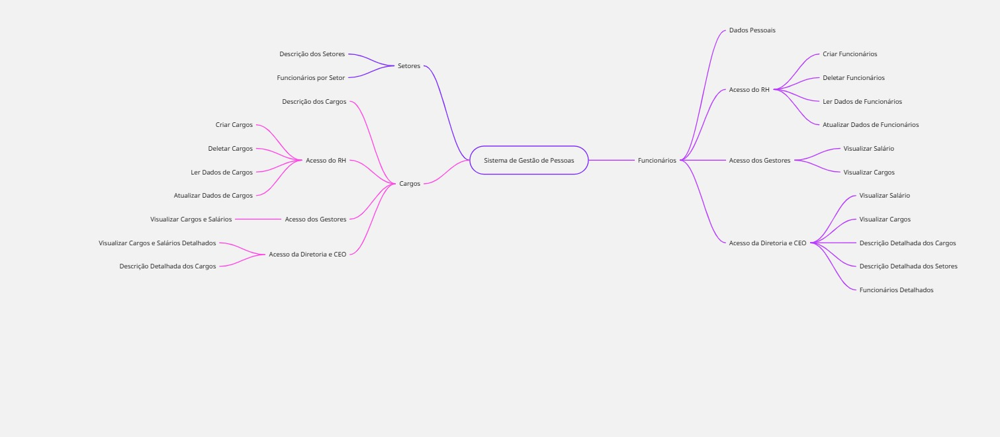

# Projeto RH

Software de Gestão de Recursos Humanos desenvolvido em Python, utilizando o framework Django.

## Índice

- [Sobre o Projeto](#sobre-o-projeto)
- [Funcionalidades](#funcionalidades)
- [Tecnologias Utilizadas](#tecnologias-utilizadas)
- [Instalação](#instalação)
- [Como Usar](#como-usar)
- [Contribuição](#contribuição)
- [Licença](#licença)
- [Contato](#contato)

## Sobre o Projeto

O Projeto RH é uma aplicação web para gerenciar informações de recursos humanos, permitindo o cadastro, edição e visualização de dados de funcionários e departamentos.

## Funcionalidades

- **Gestão de Pessoal**: Cadastro e gerenciamento de funcionários.
- **Gestão de Departamentos**: Administração dos departamentos da empresa.
- **Relatórios**: Geração de relatórios relacionados aos recursos humanos.

## Tecnologias Utilizadas

- **Linguagem**: Python
- **Framework**: Django
- **Banco de Dados**: SQLite (padrão do Django, pode ser alterado conforme necessidade)
- **Front-end**: HTML, CSS e JavaScript

## 🧠 Mapa Mental do Sistema de RH

Este diagrama resume a estrutura geral do sistema e suas funcionalidades principais.


[Ver Mapa Mental do Sistema](https://raw.githubusercontent.com/washingtonpereira/Projeto_RH/main/docs/mapa_mental_sistema.jpg)

## Instalação

1. **Clone o repositório**:

   ```bash
   git clone https://github.com/washingtonpereira/Projeto_RH.git

   
